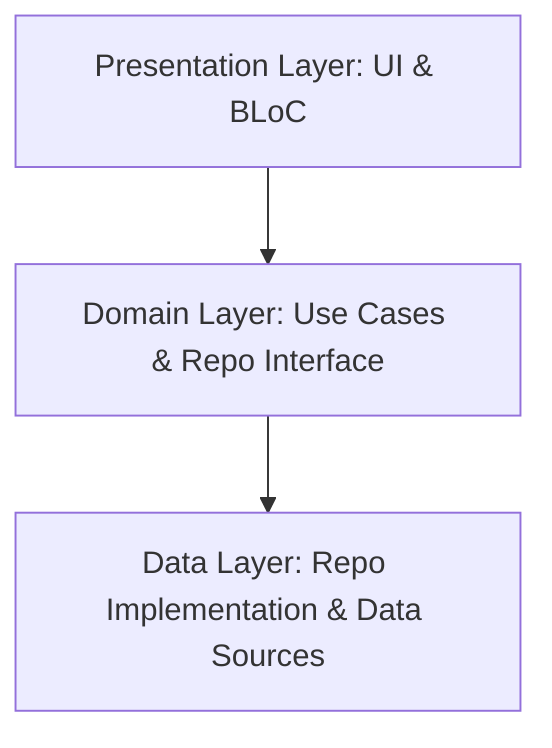

# Flutter Clean Architecture Template

A production-ready Flutter project constructed using **Clean Architecture** combined with a **Feature-First** structure.

---

## 🏛 Architecture Overview

The codebase is organized to enforce a strict separation of concerns, scalability, and testability. It follows a multi-layered design separated by core infrastructure and module-specific features.



### Layer Separation
1. **Presentation Layer (`ui/` & `bloc/`)**: Governs user interfaces and state transitions. Rebuilds are scoped tightly using the BLoC pattern.
2. **Domain Layer (`domain/`)**: Holds the business logic (Use Cases) and abstracts data operations (Repository Interfaces). It depends on nothing external.
3. **Data Layer (`data/` & `models/`)**: Manages external data sources (network requests via Dio/Retrofit and local storage via Hive) and contains the concrete Repository implementations.

---

## 📁 Codebase Organization

The codebase is split into feature modules and shared core infrastructure. Below is the detailed file hierarchy showing how each layer and directory is structured:

```
lib/
├── core/                                # Core shared infrastructure and frameworks
│   ├── api/                             # Network layer configuration
│   │   ├── base_response/               # Standardized wrappers for API envelopes
│   │   │   └── base_response.dart
│   │   ├── exceptions/                  # Global network and status-code exceptions
│   │   │   └── app_exception.dart
│   │   ├── interceptors/                # Dio interceptors (Logging, Error handling, Security)
│   │   │   ├── custom_interceptors.dart
│   │   │   ├── http_logger_interceptor.dart
│   │   │   └── internet_interceptor.dart
│   │   ├── api_endpoints.dart           # Static API endpoint URIs
│   │   └── api_module.dart              # Dio configuration and singleton providers
│   ├── db/                              # Local database setups and Hive configurations
│   │   └── app_db.dart                  # High-level local storage key-value wrapper
│   ├── locator/                         # Service locator for dependency injection
│   │   └── locator.dart                 # Registry setups for singletons and dependencies
│   ├── utils/                           # Core utilities
│   │   └── app_result.dart              # Functional Success/Failure wrappers
│   └── app_bloc_observer.dart           # Global BLoC state transitions logger
│
├── features/                            # Feature modules following Clean Architecture
│   ├── auth/                            # Authentication module
│   │   ├── bloc/                        # Auth BLoC (Events, States, and Business logic)
│   │   │   ├── auth_bloc.dart
│   │   │   ├── auth_event.dart
│   │   │   └── auth_state.dart
│   │   ├── data/                        # Concrete REST client datasources
│   │   │   └── datasource/
│   │   │       └── auth_api.dart
│   │   ├── domain/                      # Abstract interfaces and Use Cases (Pure Dart)
│   │   │   ├── repository/
│   │   │   │   └── i_auth_repository.dart
│   │   │   └── usecases/
│   │   │       ├── login_use_case.dart
│   │   │       └── sign_up_use_case.dart
│   │   ├── models/                      # JSON DTO models for network boundary
│   │   │   ├── request/
│   │   │   │   ├── login_request_model.dart
│   │   │   │   └── sign_up_req_model.dart
│   │   │   └── response/
│   │   │       ├── login_response_model.dart
│   │   │       └── sign_up_response_model.dart
│   │   ├── repository/                  # Repository implementations (Aggregates network & local db)
│   │   │   └── auth_repository.dart
│   │   └── ui/                          # Presentation screens
│   │       ├── login_page.dart
│   │       └── sign_up_page.dart
│   └── home/                            # Home / Categories Dashboard module
│       ├── bloc/                        # Home BLoC
│       ├── data/                        # Home Datasource
│       ├── domain/                      # Use Cases & Interfaces
│       ├── models/                      # Category & User list models
│       ├── repository/                  # Home Repository Implementation
│       └── ui/                          # Category and Dashboard Pages
│
├── routes/                              # Navigation and routing module
│   ├── app_navigator.dart               # Navigation stack operations utility
│   ├── app_routes.dart                  # Routing tables configuration
│   └── app_routes.gr.dart               # Code-generated routing adapters
│
├── service/                             # Global services layer
│   ├── enc_service.dart                 # AES key derivation & payload encryption utility
│   ├── get_device_info.dart             # Platform parameters collector (OS details, UUID)
│   └── network_service.dart             # Connection monitor & bottom sheet trigger
│
├── values/                              # Constant design tokens & utility extensions
│   ├── extensions/                      # Spacing, String and Context extensions
│   │   ├── context.extensions.dart
│   │   ├── double_extensions.dart
│   │   ├── string_extensions.dart
│   │   └── widget_extensions.dart
│   ├── app_colors.dart                  # Color tokens
│   ├── app_constants.dart               # AES keys, Base URLs, configuration constants
│   ├── app_spacing.dart                 # Unified horizontal/vertical margins and sizing
│   ├── app_text_style.dart              # Global typography mappings
│   └── app_theme.dart                   # Light/Dark material theme structures
│
└── widgets/                             # Shared/Reusable UI components
    ├── app_button.dart
    ├── app_snackbar.dart
    ├── app_textfield.dart
    ├── auto_refresh_builder.dart
    └── glass_dialog.dart
```

---

## 🎨 Custom Core UI Components

The project includes custom-built, highly-optimized components that implement debouncing, micro-animations, theme-aware splash colors, and single-active notification systems:

### 1. `AppButton` & `DebouncedButton`
* **Tap Debouncing**: Utilizes a static global `DebouncedButton` to ignore rapid consecutive taps within a default 1-second interval, preventing multiple form submissions or duplicate network calls.
* **Micro-Animations**: Implements an `AnimationController`-driven scale-down (to `0.94`) and scale-back-up animation on tap. The scaling effect can be toggled using `enableScale`.
* **Dynamic HSL Splash**: Calculates harmonious, high-contrast ripple splash overlays using HSL transformations of the button's background color. The ripple splash can be toggled using `enableSplash`.
* **Typography Integration**: Integrates directly with the design system's `AppTextStyle` and layout tokens (like `flutter_screenutil`'s `.w` and `.h`).

### 2. `AppSnackbar` (Toastification Integration)
* **Stacking Prevention**: Integrated globally via `ToastificationWrapper` with `maxToastLimit: 1` in `main.dart`. This ensures that only one toast is visible at any given time, preventing user interface clutter.
* **Direct Triggering**: Exposes static helpers (`showSuccess`, `showError`, `showInfo`, and `showWarning`) that immediately display overlay notifications styled with the app's predefined text styles and theme-specific colors.

### 3. `AppListView` (Edge-to-Edge Scrollable Wrapper)
* **Constructor Overloads**: Provides drop-in replacements for standard list views via `AppListView()`, `AppListView.builder()`, and `AppListView.separated()`.
* **Platform-Specific Padding**: Automatically resolves and integrates the system navigation bar space (`MediaQuery.paddingOf(context).bottom` / `systemBottomNavigationBarSpace`) into the list's interior `padding` property **only on Android**. This preserves the edge-to-edge scrolling effect while preventing the last item from getting stuck under the navigation bar.

### 4. `AutoRefreshBuilder` (Connectivity State recovery)
* **Connection Observer**: Listens to the `onInternetRestored` broadcast stream from the global `NetworkService`.
* **Automatic Reloading**: Once connection recovery is detected, it automatically fires the `onRetry` callback (e.g. to request/re-fetch lists or reload views on network state transition from offline to online).

---

## 📱 Edge-to-Edge Design Compatibility

The architecture is fully compatible with Android 15's forced edge-to-edge layout constraints, and ensures identical behavior on Android 10+ (API 29+):
* **Adaptable Scrollables (`AppListView`)**: Fits the window natively under transparent system bars while protecting content using resolved system bottom navigation bar insets (`systemBottomNavigationBarSpace`) in list views.
* **Native Backwards Compatibility**: Programmatically forces the decor layout under system bars and sets status and navigation colors to transparent inside [MainActivity.kt](file:///Users/hyperlink/StudioProjects/bloc_architecture/android/app/src/main/kotlin/com/example/bloc_architecture/MainActivity.kt) on older Android versions.
* **Fully Transparent Bars**: Disables the system's default translucent contrast scrims in both light and dark mode (`systemNavigationBarContrastEnforced: false`), ensuring navigation bars remain fully transparent.

---

## 🏛 Layer & Component Responsibilities

### 1. `core/` (Shared Infrastructure)
* **`api/`**: Configures the REST client (Dio & Retrofit), handles response parsing in `base_response.dart`, catches HTTP error codes in `app_exception.dart`, and runs request logging, offline verification, and auth token Injection.
* **`db/`**: Handles initialization and lifecycle of local Hive boxes. The wrapper `app_db.dart` provides clean, type-safe getters/setters for persistent session variables (e.g. login tokens, language configurations, and cached user details).
* **`locator/`**: Holds dependency registries using `GetIt`. It handles async registrations (like databases or device info fetching) and exposes lazy setups for repositories and BLoCs.
* **`utils/`**: Houses utility classes like `AppResult` (`Success` and `Failure`) to enforce functional programming and type-safe data returns.

### 2. `features/` (Clean Architecture Feature-First)
* **`ui/`**: Screen views, widgets, and dialog builders. No state updates or business decisions occur here. UI responds only to events emitted by the BLoC and outputs UI configurations accordingly.
* **`bloc/`**: Manages presentation state. Receives UI events, invokes use cases in the domain layer, and emits state payloads for UI rebuilds.
* **`domain/`**: The core of feature logic. Written in pure Dart without frameworks.
  * **`usecases/`**: Executes single business operations (e.g. `LoginUseCase`).
  * **`repository/`**: Establishes repository interfaces defining how data acts (decoupled from actual implementation).
* **`data/` & `repository/`**:
  * **`data/datasource/`**: Interfaces directly with remote web services (Dio/Retrofit) and databases.
  * **`repository/`**: Concrete implementation of domain repository interfaces. Handles raw data fetching, catches exceptions, performs parameter encryption, and wraps results in `AppResult` for the presentation layer.
* **`models/`**: Serialization/deserialization classes mapping input/output payloads. Fully structured as JSON-serializable DTOs.

### 3. `routes/` (AutoRoute Navigation)
* Configures static paths, child sub-pages, guards, and transition animations.
* **`app_navigator.dart`** encapsulates operations like `pop()`, `replaceAll()`, and `popUntil()` inside a clean API, preventing view layer dependency on the raw `auto_route` syntax.

### 4. `service/` (Helper Singletons)
* Dedicated utility packages that provide system-wide data updates, such as AES encryption/decryption, connectivity listener dialogues, and device specification fetchers.

---

## 🛠 Tech Stack & Core Libraries

- **State Management**: [flutter_bloc](https://pub.dev/packages/flutter_bloc) — Structured, predictable state management.
- **Dependency Injection**: [get_it](https://pub.dev/packages/get_it) — High performance service locator for lazy/async singletons.
- **Network client**: [dio](https://pub.dev/packages/dio) & [retrofit](https://pub.dev/packages/retrofit) — Type-safe, annotation-based REST client with custom interceptors for request logging, token refresh, and network failure fallback.
- **Local Database**: [hive](https://pub.dev/packages/hive) — Lightweight, fast key-value database for locally cached variables.
- **Routing**: [auto_route](https://pub.dev/packages/auto_route) — Compile-time generated, strongly-typed routing.
- **Cryptography**: [encrypt](https://pub.dev/packages/encrypt) — AES-CBC parameter encryption for secure payload transfer over the network.
- **Responsive Layout**: [flutter_screenutil](https://pub.dev/packages/flutter_screenutil) — Adapts screen sizes, margins, and text dimensions dynamically across platforms.
- **Toast & Snackbars**: [toastification](https://pub.dev/packages/toastification) — Beautiful, customizable, dynamic toast and snackbar notifications.

---

## ⚡ Getting Started & Development Commands

### 1. Configure Environment Variables
Create a `.env` file in the root directory of the project. This file is required to store application configurations and secret keys (such as the AES encryption key) and is loaded at runtime:
```env
BACKEND_AES_KEY=GOkuTthyu094jgh56YHVhf767llJYLKF
```
> [!IMPORTANT]
> The `.env` file is registered under the `assets:` section of `pubspec.yaml` to be compiled into the application bundle. Avoid pushing production credentials to public source repositories.

### 2. Install Dependencies
```bash
flutter pub get
```

### 3. Generate Code (Retrofit & AutoRoute)
Ensure the code generation watcher is running to compile serialization, network clients, and routes:
```bash
# Run one-off generation
dart run build_runner build --delete-conflicting-outputs

# Watch for file modifications
dart run build_runner watch --delete-conflicting-outputs
```

### 4. Generate Localizations (Internationalization)
Generate localizations delegate classes and translation support mappings:
```bash
# Using Flutter Intl (Localizely utility)
flutter pub run intl_utils:generate

# Alternative standard Flutter gen-l10n tool
flutter gen-l10n
```

### 5. Generate Launcher Icons & Splash Screens
To generate/update application launcher icons and native splash screens using their respective configuration files:
```bash
# Generate launcher icons
dart run flutter_launcher_icons -f flutter_launcher_icons.yaml

# Generate native splash screens
dart run flutter_native_splash:create --path=flutter_native_splash.yaml
```

### 6. Static Code Analysis & Tests
To verify formatting, run static analysis checks, and run the test suite:
```bash
# Format code
dart format .

# Run static analysis
flutter analyze

# Run unit and widget tests
flutter test
```

### 7. Rename Application Package Name
To rename the Android package name and iOS bundle identifier across all platforms:
```bash
dart run change_app_package_name:main <new_package_name>
```
*Example:*
```bash
dart run change_app_package_name:main com.example.newappname
```

### 8. Changing the Application Name
To fully rename the application, update the name parameter in the following locations:
1. **Platform Manifests (App Display Name)**:
   - **Android**: Update `android:label` under the `<application>` node in `android/app/src/main/AndroidManifest.xml`.
   - **iOS**: Update `CFBundleDisplayName` and `CFBundleName` in `ios/Runner/Info.plist`.
2. **MaterialApp Title**:
   - Update the `title` or `onGenerateTitle` callback parameter of the `MaterialApp` widget inside [main.dart](file:///Users/hyperlink/StudioProjects/bloc_architecture/lib/main.dart).
3. **Project Name**:
   - Update the `name:` field at the very top of [pubspec.yaml](file:///Users/hyperlink/StudioProjects/bloc_architecture/pubspec.yaml). Run `flutter pub get` and regenerate files using `build_runner`.

---

## 🚀 CI/CD Pipeline
The project includes a pre-configured GitHub Actions workflow located at [.github/workflows/dart.yml](file:///Users/hyperlink/StudioProjects/bloc_architecture/.github/workflows/dart.yml) that:
1. Installs the exact Flutter version (`3.38.9`).
2. Leverages caching for the SDK and pub dependencies (`cache: true`) to optimize execution times.
3. Automatically runs lint checks (`flutter analyze`) and execution tests (`flutter test`) on pushes and pull requests to the `main` branch.

