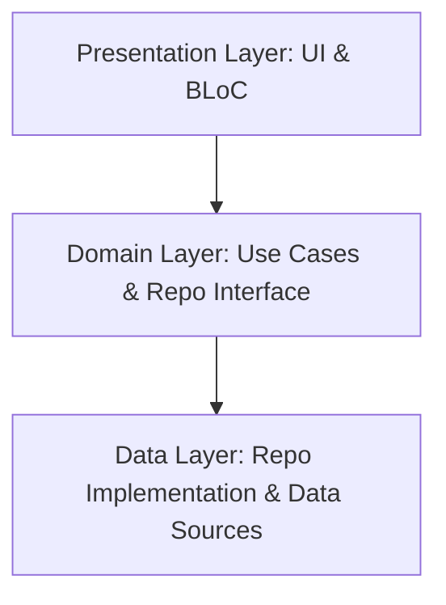

# Flutter Clean Architecture Template

A production-ready Flutter project constructed using **Clean Architecture** combined with a **Feature-First** structure.

---

## 🏛 Architecture Overview

The codebase is organized to enforce a strict separation of concerns, scalability, and testability. It follows a multi-layered design separated by core infrastructure and module-specific features.



### Layer Separation
1. **Presentation Layer (`ui/` & `bloc/`)**: Governs user interfaces and state transitions. Rebuilds are scoped tightly using the BLoC pattern.
2. **Domain Layer (`domain/`)**: Holds the business logic (Use Cases) and abstracts data operations (Repository Interfaces). It depends on nothing external.
3. **Data Layer (`data/` & `models/`)**: Manages external data sources (network requests via Dio/Retrofit and local storage via Hive) and contains the concrete Repository implementations.

---

## 📁 Codebase Organization

The codebase is split into feature modules and shared core infrastructure. Below is the detailed file hierarchy showing how each layer and directory is structured:

```
lib/
├── core/                                # Core shared infrastructure and frameworks
│   ├── api/                             # Network layer configuration
│   │   ├── base_response/               # Standardized wrappers for API envelopes
│   │   │   └── base_response.dart
│   │   ├── exceptions/                  # Global network, status-code, and business exceptions
│   │   │   ├── app_exception.dart
│   │   │   └── dio_exception_utils.dart # Bulletproof DioException parser
│   │   ├── interceptors/                # Dio interceptors (Logging, Security, Retries)
│   │   │   ├── custom_interceptors.dart
│   │   │   ├── http_logger_interceptor.dart
│   │   │   ├── internet_interceptor.dart
│   │   │   └── retry_interceptor.dart   # Exponential backoff network retry
│   │   ├── api_endpoints.dart           # Static API endpoint URIs
│   │   └── api_module.dart              # Dio configuration and singleton providers
│   ├── config/                          # Typed runtime application configuration
│   │   └── app_config.dart              # AppEnvironment manager & .env loader
│   ├── db/                              # Local database setups and Hive configurations
│   │   └── app_db.dart                  # High-level local storage key-value wrapper
│   ├── locator/                         # Service locator for dependency injection
│   │   └── locator.dart                 # Registry setups for singletons and dependencies
│   ├── utils/                           # Core utilities
│   │   ├── app_logger.dart              # Structured level-based logger
│   │   ├── crash_reporter.dart          # ICrashReporter interface & default handler
│   │   └── app_result.dart              # Functional Success/Failure wrappers
│   └── app_bloc_observer.dart           # Global BLoC state transitions & error logger
│
├── features/                            # Feature modules following Clean Architecture
│   ├── auth/                            # Authentication module
│   │   ├── bloc/                        # Auth BLoC (Events, States, and Business logic)
│   │   │   ├── auth_bloc.dart
│   │   │   ├── auth_event.dart
│   │   │   └── auth_state.dart
│   │   ├── data/                        # Concrete REST client datasources
│   │   │   └── datasource/
│   │   │       └── auth_api.dart
│   │   ├── domain/                      # Abstract interfaces and Use Cases (Pure Dart)
│   │   │   ├── repository/
│   │   │   │   └── i_auth_repository.dart
│   │   │   └── usecases/
│   │   │       ├── login_use_case.dart
│   │   │       └── sign_up_use_case.dart
│   │   ├── models/                      # JSON DTO models for network boundary
│   │   │   ├── request/
│   │   │   │   ├── login_request_model.dart
│   │   │   │   └── sign_up_req_model.dart
│   │   │   └── response/
│   │   │       ├── login_response_model.dart
│   │   │       └── sign_up_response_model.dart
│   │   ├── repository/                  # Repository implementations (Aggregates network & local db)
│   │   │   └── auth_repository.dart
│   │   └── ui/                          # Presentation screens
│   │       ├── login_page.dart
│   │       └── sign_up_page.dart
│   └── home/                            # Home / Users Dashboard module
│       ├── bloc/                        # Home BLoC (Events, States, and Business logic)
│       │   ├── home_bloc.dart
│       │   ├── home_event.dart
│       │   └── home_state.dart
│       ├── data/                        # Network APIs and Repository implementations
│       │   ├── datasource/
│       │   │   └── home_api.dart
│       │   └── repository/
│       │       └── home_repository.dart
│       ├── domain/                      # Pure business logic layer
│       │   ├── repository/
│       │   │   └── i_home_repository.dart
│       │   └── usecases/
│       │       └── get_users_use_case.dart
│       ├── models/                      # Serialization structures
│       │   └── response/
│       │       └── reqres_user_model.dart
│       └── ui/                          # Presentation views
│           └── home_page.dart
│
├── routes/                              # Navigation and routing module
│   ├── app_navigator.dart               # Navigation stack operations utility
│   ├── app_routes.dart                  # Routing tables configuration
│   └── app_routes.gr.dart               # Code-generated routing adapters
│
├── service/                             # Global services layer
│   ├── app_permission_handler.dart      # Unified location, camera, microphone, photos & storage permissions requester
│   ├── enc_service.dart                 # AES key derivation & payload encryption utility
│   ├── get_device_info.dart             # Platform parameters collector (OS details, UUID)
│   ├── location_service.dart            # High-accuracy geolocation & reverse geocoding utility
│   └── network_service.dart             # Connection monitor & bottom sheet trigger
│
├── values/                              # Constant design tokens & utility extensions
│   ├── extensions/                      # Spacing, String and Context extensions
│   │   ├── context.extensions.dart
│   │   ├── double_extensions.dart
│   │   ├── string_extensions.dart
│   │   └── widget_extensions.dart
│   ├── app_colors.dart                  # Color tokens
│   ├── app_constants.dart               # AES keys, Base URLs, configuration constants
│   ├── app_spacing.dart                 # Unified horizontal/vertical margins and sizing
│   ├── app_text_style.dart              # Global typography mappings
│   └── app_theme.dart                   # Light/Dark material theme structures
│
└── widgets/                             # Shared/Reusable UI components
    ├── app_button.dart
    ├── app_dropdown_textfield.dart
    ├── app_image.dart
    ├── app_list_view.dart
    ├── app_refresh_indicator.dart
    ├── app_snackbar.dart
    ├── app_textfield.dart
    ├── auto_refresh_builder.dart
    ├── custom_app_bar.dart
    ├── glass_container.dart
    ├── glass_dialog.dart
    └── app_media_picker_bottom_sheet.dart
```

---

## 🎨 Custom Core UI Components

The project includes custom-built, highly-optimized components that implement debouncing, micro-animations, theme-aware splash colors, and single-active notification systems:

### 1. `AppButton` & `DebouncedButton`
* **Tap Debouncing**: Utilizes a static global `DebouncedButton` to ignore rapid consecutive taps within a default 1-second interval, preventing multiple form submissions or duplicate network calls.
* **Micro-Animations**: Implements an `AnimationController`-driven scale-down (to `0.94`) and scale-back-up animation on tap. The scaling effect can be toggled using `enableScale`.
* **Dynamic HSL Splash**: Calculates harmonious, high-contrast ripple splash overlays using HSL transformations of the button's background color. The ripple splash can be toggled using `enableSplash`.
* **Typography Integration**: Integrates directly with the design system's `AppTextStyle` and layout tokens (like `flutter_screenutil`'s `.w` and `.h`).

### 2. `AppSnackbar` (Toastification Integration)
* **Stacking Prevention**: Integrated globally via `ToastificationWrapper` with `maxToastLimit: 1` in `main.dart`. This ensures that only one toast is visible at any given time, preventing user interface clutter.
* **Direct Triggering**: Exposes static helpers (`showSuccess`, `showError`, `showInfo`, and `showWarning`) that immediately display overlay notifications styled with the app's predefined text styles and theme-specific colors.

### 3. `AppListView` (Edge-to-Edge Scrollable Wrapper)
* **Constructor Overloads**: Provides drop-in replacements for standard list views via `AppListView()`, `AppListView.builder()`, and `AppListView.separated()`.
* **Platform-Specific Padding**: Automatically resolves and integrates the system navigation bar space (`MediaQuery.paddingOf(context).bottom` / `systemBottomNavigationBarSpace`) into the list's interior `padding` property **only on Android**. This preserves the edge-to-edge scrolling effect while preventing the last item from getting stuck under the navigation bar.

### 4. `AutoRefreshBuilder` (Connectivity State recovery)
* **Connection Observer**: Listens to the `onInternetRestored` broadcast stream from the global `NetworkService`.
* **Automatic Reloading**: Once connection recovery is detected, it automatically fires the `onRetry` callback (e.g. to request/re-fetch lists or reload views on network state transition from offline to online).

### 5. `AppRefreshIndicator`
* **Adaptive spinner**: Wraps `RefreshIndicator.adaptive` — renders a `CupertinoActivityIndicator` on iOS and a `CircularProgressIndicator` on Android automatically.
* **Theme-aware color**: Pulls `color` from `Theme.of(context).colorScheme.primary`, respecting both light and dark themes without any hardcoded values.

### 6. `AppImage`
* **Multi-source resolution**: Resolves images in priority order — remote URL → local `File` → asset path → initials/fallback. Network images are disk-cached via `cached_network_image`.
* **Shimmer placeholder**: Shows an animated shimmer skeleton (`shimmer_animation`) while a network image loads. The placeholder can be overridden via the `placeHolder` parameter.
* **Theme-aware fallback**: When no source resolves, renders the first letter of `initial` (if provided) or a material icon, both sized proportionally to the container and colored from the active `ColorScheme`.
* **Flexible sizing**: Supports both circular (`radius`) and rectangular (`height`/`width`) layouts; corner rounding is controlled via `roundedCorner` (defaults to `radius`).

### 7. `AppDropdownTextField`
* **Adaptive Cupertino Picker**: Shows an overlay sheet containing a scrollable `CupertinoPicker` when tapped, facilitating standard dropdown list selection on mobile.
* **Memory Leak Protection**: Explicitly disposes and detaches listeners attached to the backing value notifier.
* **Input Synchronization**: Updates the text field controller automatically when the value notifier triggers.

* **Rounded Corners**: Integrates a default shape layout with rounded bottom corners (`20.0`) customizable per screen.

### 9. `AppMediaPickerBottomSheet`
* **Adaptive Bottom Sheet Picker**: Displays an elegant modal sheet prompting users to select source (Camera/Gallery) for image/video capture, with optional document picking via `file_picker`.
* **Automatic Image Compression**: Automatically compresses images larger than 150 KB down using `flutter_image_compress` at quality 10 before passing back to the handler callback.
* **Unified Permission Management**: Intercepts camera/storage permission requests transparently across platforms using `permission_handler` and redirects permanently denied users to app settings.
* **Theme integration**: Draws design parameters and styling configurations directly from the active `ThemeData` to automatically blend with Light & Dark UI contexts.

---

## 📱 Edge-to-Edge Design Compatibility

The architecture is fully compatible with Android 15's forced edge-to-edge layout constraints, and ensures identical behavior on Android 10+ (API 29+):
* **Adaptable Scrollables (`AppListView`)**: Fits the window natively under transparent system bars while protecting content using resolved system bottom navigation bar insets (`systemBottomNavigationBarSpace`) in list views.
* **Native Backwards Compatibility**: Programmatically forces the decor layout under system bars and sets status and navigation colors to transparent inside [MainActivity.kt](file:///Users/hyperlink/StudioProjects/bloc_architecture/android/app/src/main/kotlin/com/example/bloc_architecture/MainActivity.kt) on older Android versions.
* **Fully Transparent Bars**: Disables the system's default translucent contrast scrims in both light and dark mode (`systemNavigationBarContrastEnforced: false`), ensuring navigation bars remain fully transparent.

---

## 🏛 Layer & Component Responsibilities

### 1. `core/` (Shared Infrastructure)
* **`api/`**: Configures the REST client (Dio & Retrofit), handles response parsing in `base_response.dart`, catches HTTP error codes in `app_exception.dart`, and runs request logging, offline verification, and auth token Injection.
* **`db/`**: Handles initialization and lifecycle of local Hive boxes. The wrapper `app_db.dart` provides clean, type-safe getters/setters for persistent session variables (e.g. login tokens, language configurations, and cached user details).
* **`locator/`**: Holds dependency registries using `GetIt`. It handles async registrations (like databases or device info fetching) and exposes lazy setups for repositories and BLoCs.
* **`utils/`**: Houses utility classes like `AppResult` (`Success` and `Failure`) to enforce functional programming and type-safe data returns.

### 2. `features/` (Clean Architecture Feature-First)
* **`ui/`**: Screen views, widgets, and dialog builders. No state updates or business decisions occur here. UI responds only to events emitted by the BLoC and outputs UI configurations accordingly.
* **`bloc/`**: Manages presentation state. Receives UI events, invokes use cases in the domain layer, and emits state payloads for UI rebuilds.
* **`domain/`**: The core of feature logic. Written in pure Dart without frameworks.
  * **`usecases/`**: Executes single business operations (e.g. `LoginUseCase`).
  * **`repository/`**: Establishes repository interfaces defining how data acts (decoupled from actual implementation).
* **`data/` & `repository/`**:
  * **`data/datasource/`**: Interfaces directly with remote web services (Dio/Retrofit) and databases.
  * **`repository/`**: Concrete implementation of domain repository interfaces. Handles raw data fetching, catches exceptions, performs parameter encryption, and wraps results in `AppResult` for the presentation layer.
* **`models/`**: Serialization/deserialization classes mapping input/output payloads. Fully structured as JSON-serializable DTOs.

### 3. `routes/` (AutoRoute Navigation)
* Configures static paths, child sub-pages, guards, and transition animations.
* **`app_navigator.dart`** encapsulates operations like `pop()`, `replaceAll()`, and `popUntil()` inside a clean API, preventing view layer dependency on the raw `auto_route` syntax.

### 4. `service/` (Helper Singletons)
* Dedicated utility packages that provide system-wide data updates, such as AES encryption/decryption, connectivity listener dialogues, and device specification fetchers.

---

## 🛠 Tech Stack & Core Libraries

- **State Management**: [flutter_bloc](https://pub.dev/packages/flutter_bloc) — Structured, predictable state management.
- **Dependency Injection**: [get_it](https://pub.dev/packages/get_it) — High performance service locator for lazy/async singletons.
- **Network client**: [dio](https://pub.dev/packages/dio) & [retrofit](https://pub.dev/packages/retrofit) — Type-safe, annotation-based REST client with custom interceptors for request logging, token refresh, and network failure fallback.
- **Image loading**: [cached_network_image](https://pub.dev/packages/cached_network_image) — Disk-cached network image widget with placeholder and error builder support.
- **Shimmer**: [shimmer_animation](https://pub.dev/packages/shimmer_animation) — Configurable shimmer skeleton loader used inside `AppImage` as a network load placeholder.
- **Local Database**: [hive](https://pub.dev/packages/hive) — Lightweight, fast key-value database for locally cached variables.
- **Routing**: [auto_route](https://pub.dev/packages/auto_route) — Compile-time generated, strongly-typed routing.
- **Cryptography**: [encrypt](https://pub.dev/packages/encrypt) — AES-CBC parameter encryption for secure payload transfer over the network.
- **Responsive Layout**: [flutter_screenutil](https://pub.dev/packages/flutter_screenutil) — Adapts screen sizes, margins, and text dimensions dynamically across platforms.
- **Toast & Snackbars**: [toastification](https://pub.dev/packages/toastification) — Beautiful, customizable, dynamic toast and snackbar notifications.

---

## ⚡ Getting Started & Development Commands

### 1. Configure Environment Variables
Create a `.env` file in the root directory of the project. This file is required to store application configurations and secret keys (such as the AES encryption key) and is loaded at runtime:
```env
BACKEND_AES_KEY=GOkuTthyu094jgh56YHVhf767llJYLKF
```
> [!IMPORTANT]
> The `.env` file is registered under the `assets:` section of `pubspec.yaml` to be compiled into the application bundle. Avoid pushing production credentials to public source repositories.

### 2. Install Dependencies
```bash
flutter pub get
```

### 3. Generate Code (Retrofit & AutoRoute)
Ensure the code generation watcher is running to compile serialization, network clients, and routes:
```bash
# Run one-off generation (recommended)
make gen

# Wipe generated files and rebuild from scratch
make clean-gen

# Watch for file modifications
dart run build_runner watch
```

### 4. Generate Localizations (Internationalization)
Generate localizations delegate classes and translation support mappings:
```bash
# Using Flutter Intl (Localizely utility)
flutter pub run intl_utils:generate

# Alternative standard Flutter gen-l10n tool
flutter gen-l10n
```

### 5. Generate Launcher Icons & Splash Screens
To generate/update application launcher icons and native splash screens using their respective configuration files:
```bash
# Generate launcher icons
dart run flutter_launcher_icons -f flutter_launcher_icons.yaml

# Generate native splash screens
dart run flutter_native_splash:create --path=flutter_native_splash.yaml
```

### 6. Building Releases

> [!IMPORTANT]
> All build commands below automatically print the **current version and build number** from `pubspec.yaml` before starting, and remind you to bump them. Always increment `version` in `pubspec.yaml` before shipping.

Each build command runs a full clean pipeline: `flutter clean` → `flutter pub get` → `make clean-gen` → build.

#### Android — APK (direct install / testing)
```bash
make build-apk
```
Output: `build/app/outputs/flutter-apk/app-release.apk`

#### Android — App Bundle (Play Store upload)
```bash
make build-aab
```
Output: `build/app/outputs/bundle/release/app-release.aab`

#### iOS — IPA (App Store / TestFlight)
```bash
make build-ipa
```
Output: `build/ios/ipa/*.ipa`
> No `pod install` step required — this project uses Swift Package Manager (SPM).

### 7. Run in Debug Mode
```bash
make run
# or
flutter run
```

### 8. Static Code Analysis & Tests
To verify formatting, run static analysis checks, and run the test suite:
```bash
# Format code
dart format .

# Run static analysis
flutter analyze

# Run unit and widget tests
flutter test
```

### 9. Rename Application Package Name
To rename the Android package name and iOS bundle identifier across all platforms:
```bash
dart run change_app_package_name:main <new_package_name>
```
*Example:*
```bash
dart run change_app_package_name:main com.example.newappname
```

### 10. Changing the Application Name
To fully rename the application, update the name parameter in the following locations:
1. **Platform Manifests (App Display Name)**:
   - **Android**: Update `android:label` under the `<application>` node in `android/app/src/main/AndroidManifest.xml`.
   - **iOS**: Update `CFBundleDisplayName` and `CFBundleName` in `ios/Runner/Info.plist`.
2. **MaterialApp Title**:
   - Update the `title` or `onGenerateTitle` callback parameter of the `MaterialApp` widget inside [main.dart](file:///Users/hyperlink/StudioProjects/bloc_architecture/lib/main.dart).
3. **Project Name**:
   - Update the `name:` field at the very top of [pubspec.yaml](file:///Users/hyperlink/StudioProjects/bloc_architecture/pubspec.yaml). Run `flutter pub get` and regenerate files using `make gen`.


---

---

## 🚀 Fastlane & Continuous Deployment

This repository includes a production-ready **Fastlane** setup for both **Android (Google Play Console)** and **iOS (App Store Connect / TestFlight)**, paired with an automated version bumping tool in `scripts/bump_version.dart`.

### 1. Prerequisites
Ensure Ruby and Fastlane are installed:
```bash
# Verify Fastlane installation
fastlane --version

# Or install via Bundler / RubyGems
bundle install
# Or via Homebrew
brew install fastlane
```

---

### 2. Android Configuration (Google Play & GCP Service Account)

To deploy to Google Play (Internal, Alpha, Beta, or Production tracks), Fastlane uses a **Google Cloud Platform (GCP) Service Account key** (`.json` or `.p8`).

#### Step-by-Step Setup:
1. **Create GCP Service Account**:
   - Open [Google Cloud Console](https://console.cloud.google.com/).
   - Select your project -> **IAM & Admin** -> **Service Accounts** -> **Create Service Account**.
   - Name the service account (e.g. `play-store-deployer`) and assign the role **Service Account User**.
2. **Generate & Download Key**:
   - Click on the created service account -> **Keys** tab -> **Add Key** -> **Create new key** (select **JSON** or **P8**).
   - Save the downloaded file to `android/fastlane/service-account.json` (this path is already in `.gitignore`).
3. **Grant Access in Google Play Console**:
   - Open [Google Play Console](https://play.google.com/console/) -> **API access**.
   - Link your Google Cloud project if not already linked.
   - Under **Users and permissions**, find your Service Account email, click **Invite user**, and grant **Admin** or **Release Manager** permissions for your app.
   *(Note: The initial APK or AAB must be uploaded manually once through the Google Play Console UI before automated API uploads can succeed).*
4. **Configure Environment Variables**:
   - Copy `.env.fastlane.example` to `.env.fastlane` (or `android/fastlane/.env.example` to `android/fastlane/.env`):
     ```bash
     GCP_SERVICE_ACCOUNT_KEY_PATH="./android/fastlane/service-account.json"
     ANDROID_PACKAGE_NAME="com.example.bloc_architecture"
     PLAY_STORE_TRACK="internal"
     ```

---

### 3. iOS Configuration (App Store Connect API Key - `.p8`)

To deploy to **Apple TestFlight** and the **App Store**, Fastlane uses the modern **App Store Connect API Key (`.p8`)** for token-based authentication without requiring 2FA SMS codes or Apple ID passwords.

#### Step-by-Step Setup:
1. **Generate API Key in App Store Connect**:
   - Open [App Store Connect](https://appstoreconnect.apple.com/) -> **Users and Access** -> **Integrations** -> **App Store Connect API**.
   - Click **+** (Generate API Key).
   - Enter a Name (e.g. `Fastlane Deploy Key`) and assign the **App Manager** or **Admin** role.
2. **Download Key & Note Identifiers**:
   - Note the **Key ID** (10-character alphanumeric code, e.g. `2X9R4HXF34`).
   - Note the **Issuer ID** (UUID format at the top of the page, e.g. `69a6de70-xxxx-xxxx-xxxx-xxxxxxxxxxxx`).
   - Download the `.p8` file (e.g. `AuthKey_2X9R4HXF34.p8`) and place it at `ios/fastlane/AuthKey.p8` (ignored by `.gitignore`).
3. **Configure Environment Variables**:
   - In `.env.fastlane` or `ios/fastlane/.env`:
     ```bash
     APP_STORE_CONNECT_KEY_ID="2X9R4HXF34"
     APP_STORE_CONNECT_ISSUER_ID="69a6de70-xxxx-xxxx-xxxx-xxxxxxxxxxxx"
     APP_STORE_CONNECT_KEY_PATH="./ios/fastlane/AuthKey.p8"
     IOS_APP_IDENTIFIER="com.example.blocArchitecture"
     APPLE_TEAM_ID="XXXXXXXXXX"
     ```

---

### 4. Automated Version Management (`pubspec.yaml`)

The version management script at `scripts/bump_version.dart` inspects and updates `version: X.Y.Z+N` directly inside [pubspec.yaml](file:///Users/hyperlink/StudioProjects/bloc_architecture/pubspec.yaml) across platforms:

| Command | Action | Example (`1.0.0+1`) |
|---|---|---|
| `make version` | Check current version and build number | `1.0.0 (build: 1)` |
| `make bump-build` | Increment build number only | `1.0.0+2` |
| `make bump-patch` | Increment patch version + build number | `1.0.1+2` |
| `make bump-minor` | Increment minor version + build number | `1.1.0+2` |
| `make bump-major` | Increment major version + build number | `2.0.0+2` |
| `make set-version v=2.0.0+10` | Set explicit version | `2.0.0+10` |

---

### 5. Makefile Command Reference

#### Versioning:
```bash
make version                    # Display current version & build number
make bump-build                 # Auto-increment build code (+1)
make bump-patch                 # Auto-increment patch version & build code
make bump-minor                 # Auto-increment minor version & build code
make bump-major                 # Auto-increment major version & build code
make set-version v=1.5.0+20     # Set custom version
```

#### Android Deployment:
```bash
make fastlane-android-internal  # Deploy AAB to Google Play Internal track
make fastlane-android-alpha     # Deploy AAB to Google Play Closed Testing (Alpha)
make fastlane-android-beta      # Deploy AAB to Google Play Open Testing (Beta)
make fastlane-android-production# Deploy AAB to Google Play Production
make fastlane-android-promote   # Promote Internal release to Production

# Auto-bump build number & deploy:
make deploy-android-internal    # bump-build + internal deploy
make deploy-android-beta        # bump-build + beta deploy
make deploy-android-production  # bump-patch + production deploy
```

#### iOS Deployment:
```bash
make fastlane-ios-beta          # Build & upload to Apple TestFlight
make fastlane-ios-release       # Build & upload to Apple App Store

# Auto-bump & deploy:
make deploy-ios-beta            # bump-build + TestFlight deploy
make deploy-ios-release         # bump-patch + App Store deploy
```

#### Unified Multi-Platform Deployment:
```bash
make deploy-beta                # Bump build number -> deploy Android Internal + iOS TestFlight
make deploy-release             # Bump patch version -> deploy Android Production + iOS App Store
```

---

## 🚀 CI/CD Pipeline
The project includes a pre-configured GitHub Actions workflow located at [.github/workflows/dart.yml](file:///Users/hyperlink/StudioProjects/bloc_architecture/.github/workflows/dart.yml) that:
1. Installs the exact Flutter version (`3.47.2`).
2. Leverages caching for the SDK and pub dependencies (`cache: true`) to optimize execution times.
3. Automatically runs lint checks (`flutter analyze`) and execution tests (`flutter test`) on pushes and pull requests to the `main` branch.
4. Uses `actions/checkout@v5` (Node.js 24 runtime) — `@v4` is deprecated on current GitHub Actions runners.

---

## 📋 Changelog

### Flutter 3.47.2 Migration
- **Flutter SDK**: Upgraded to `3.47.2` (stable). Dart `3.13.2`, DevTools `2.60.0`.
- **CI**: Bumped Flutter version pin to `3.47.2` in `dart.yml`.

### iOS: CocoaPods → Swift Package Manager
- Ran `pod deintegrate` to strip all CocoaPods build phases and xcconfig references from `Runner.xcodeproj`.
- Removed `#include` lines for `Pods-Runner.debug.xcconfig` / `Pods-Runner.release.xcconfig` from `ios/Flutter/Debug.xcconfig` and `ios/Flutter/Release.xcconfig`.
- Removed stale `Pods/Pods.xcodeproj` reference from `Runner.xcworkspace/contents.xcworkspacedata`.
- Deleted `Podfile`, `Podfile.lock`, and `ios/.symlinks/`.
- Flutter tooling now manages plugin linking via the auto-generated `FlutterGeneratedPluginSwiftPackage` SPM package.

### Dependency Fixes
- **`device_info_plus`**: Pinned to `12.1.0` (exact). Versions `12.2.0`–`13.2.0` call `[NSProcessInfo isiOSAppOnVision]` guarded by `@available(iOS 26.1, *)`, which fails to compile against Xcode 26.0.1's iOS 26.0 SDK headers.
- **`dio 5.10.0`**: Added missing `DioExceptionType.transformTimeout` case in `dio_exception_utils.dart` — new enum value introduced in this release caused an exhaustiveness error in the switch statement.

### `AppListView` — `ScrollCacheExtent` Migration
- Replaced deprecated `cacheExtent: double?` parameter on all three `ListView` constructors (`normal`, `builder`, `separated`) with `scrollCacheExtent: ScrollCacheExtent.pixels(...)` — `cacheExtent` was deprecated after Flutter `3.41.0-0.0.pre`.
- The public `cacheExtent: double?` field on `AppListView` is preserved for backward compatibility; the conversion happens internally at the `ListView` call site.

### New Widgets
- **`AppRefreshIndicator`** (`widgets/app_refresh_indicator.dart`): Thin wrapper around `RefreshIndicator.adaptive` with theme-aware `colorScheme.primary` color. Replaces raw `RefreshIndicator` usage across the codebase (first applied in `home_page.dart`).
- **`AppImage`** (`widgets/app_image.dart`): Universal image widget supporting remote URLs (disk-cached via `cached_network_image`), local files, and assets. Includes animated shimmer placeholder, theme-aware fallback with initials or icon, and both circular and rectangular layout modes.
- **`AppDropdownTextField`** (`widgets/app_dropdown_textfield.dart`): Fully unified adaptive dropdown with a CupertinoPicker overlay, memory leak protection, and value notifier syncing. Used in `HomePage` for user sorting.
- **`CustomAppBar` / `BaseAppBar`** (`widgets/custom_app_bar.dart`): Completely stateless and immutable app bar widget with customizable bottom borders, back navigation integration, and dynamic preferredSize support (used in `HomePage`, `LoginPage`, and `SignUpPage`).
- **`AppMediaPickerBottomSheet`** (`widgets/app_media_picker_bottom_sheet.dart`): Adaptive modal sheet for capturing and picking camera/gallery media and files, bundled with automatic image compression, unified permissions checking, and Material 3 design support.

### New Dependencies
- **`cached_network_image: ^3.4.1`** — disk-cached network image loading used by `AppImage`.
- **`shimmer_animation: ^2.2.1`** — shimmer skeleton animation used as `AppImage`'s network load placeholder.
- **`file_picker: ^8.1.4`** — file and document selection wrapper.
- **`flutter_image_compress: ^2.3.0`** — fast image compressor for network optimization.
- **`image_picker: ^1.1.2`** — photo/video capture and picker on iOS/Android.
- **`permission_handler: ^11.3.1`** — permission request and check wrapper.
- **`path: ^1.9.0`** — file path manipulation utility.
- **`geocoding: ^3.0.0`** — geocoding and reverse geocoding utility.
- **`geolocator: ^13.0.1`** — device coordinates tracker.
